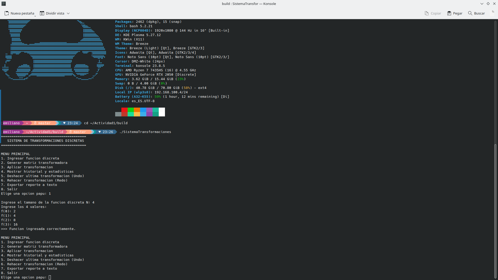
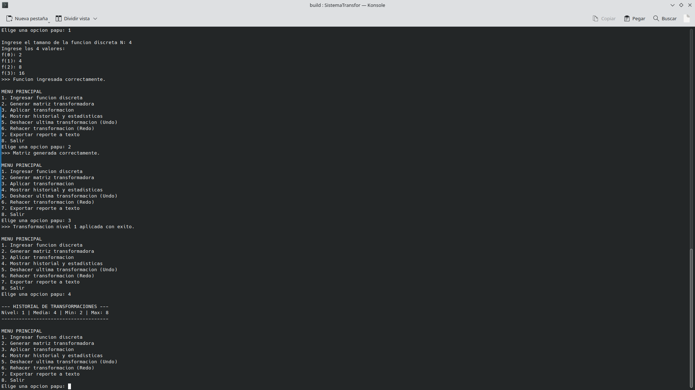

# Reporte de Resultados: Sistema de Transformaciones Discretas
**Materia:** Estructura de Datos  
**Institución:** Universidad Politécnica de Victoria  
**Alumno:** Cruz Emiliano Garcia Cruz  
**GitHub:** [emilianogarcia-eng](https://github.com/emilianogarcia-eng)  

---

## 1. Introducción y Descripción del Problema
El presente proyecto implementa un sistema en C++ capaz de procesar una función discreta definida en un intervalo finito, aplicando un operador de diferenciación discreta. Para ello, se genera una matriz de transformación de tamaño $N \times N$.

El objetivo principal es calcular la diferencia discreta entre puntos contiguos y permitir al usuario aplicar múltiples transformaciones sucesivas. Todo el historial se gestiona mediante un sistema completo de **Deshacer (Undo)** y **Rehacer (Redo)** implementado desde cero.

## 2. Estructuras de Datos Utilizadas
Para cumplir con los requerimientos estrictos de la actividad, **no se utilizaron contenedores estándar de C++** (como `std::vector` o `std::list`). Todo el manejo de memoria es dinámico y se implementaron las siguientes clases mediante plantillas genéricas (`template<class T>`):

* **Vector<T>:** Arreglo dinámico base que redimensiona su capacidad automáticamente.
* **Matriz<T>:** Arreglo bidimensional dinámico adaptado para la sobrecarga de operadores.
* **ListaEnlazada<T>:** Almacena el historial completo de las transformaciones y sus estadísticas (nivel, media, mínimo, máximo).
* **Pila<T> (Stack):** Implementada sobre el vector dinámico, gestiona la función **Deshacer (Undo)** (LIFO).
* **Cola<T> (Queue):** Implementada sobre el vector dinámico, gestiona la función **Rehacer (Redo)** (FIFO).

## 3. Evidencia de Funcionamiento
A continuación se muestran las capturas de la ejecución del programa en la terminal de Ubuntu:

*Figura 1: Captura del menú principal ingresando la función y generando la matriz.*

*Figura 2: Captura del uso del sistema Undo/Redo y la impresión del historial.*

## 4. Conclusiones
El desarrollo de este proyecto demostró la importancia de comprender la gestión de memoria a bajo nivel en C++. Al prescindir de las librerías estándar, se expuso el funcionamiento interno de estructuras fundamentales como las Listas, Pilas y Colas, logrando un sistema robusto, sin fugas de memoria y empaquetado profesionalmente utilizando **CMake**.
